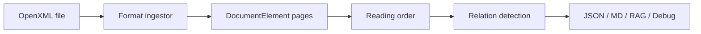

# openxml-parser

Open XML 문서(PPTX, DOCX, XLSX, HWPX)를 **구조화 JSON · Markdown · RAG chunk**로 변환하는 layout-first 문서 파서입니다.

레이아웃·읽기 순서·표 병합·관계 추론(`title_of`, `caption_of`)을 우선하고, VLM/시맨틱 모델은 확장 포트로만 연결합니다.

[](LICENSE)
[](https://www.python.org/downloads/)

## Features

- **Multi-format ingestion** — `.pptx`, `.docx`, `.xlsx`, `.hwpx` (플러그형 `DocumentIngestor`)
- **PPTX layout pipeline** — XY-Cut / row clustering reading order, 병합셀 복원, nested table, crop 이미지 추출
- **Relation inference** — rule-based `caption_of` / `title_of` (+ optional `CaptionVerifier` hook)
- **LLM-friendly output** — JSON, Markdown(HTML table), RAG chunks, debug report
- **DDD structure** — domain ports + infrastructure adapters

## Supported formats

| Format | Status | Notes |
|--------|--------|--------|
| `.pptx` | Full | Slide coordinates, master shapes, OMML math (linear) |
| `.docx` | Beta | Sections, headings/lists, tables, inline images |
| `.xlsx` | Beta | Sheet table + merged cells; embedded images/charts |
| `.hwpx` | Beta | Section XML; tables with colspan |
| `.hwp` (binary) | Not supported | Use HWPX export |

## Quick start

Requires [uv](https://docs.astral.sh/uv/) (or pip).

```bash
git clone https://github.com/Gaebobman/openxml-parser.git
cd openxml-parser
uv sync
```

Parse the included public samples (`public_samples/`):

```bash
# PPTX (full layout pipeline)
uv run doc-parser public_samples/openxml_parser_public_sample.pptx \
  --output-md out/sample.md --output-json out/sample.json --assets-dir out/sample_assets

# DOCX / XLSX / HWPX
uv run doc-parser public_samples/openxml_parser_public_sample.docx --output-md out/doc.md
uv run doc-parser public_samples/openxml_parser_public_sample.xlsx --output-json out/sheet.json
uv run doc-parser public_samples/openxml_parser_public_sample.hwpx --output-md out/hwp.md
```

## CLI

```text
doc-parser INPUT [--output-json PATH] [--output-md PATH]
               [--output-rag-json PATH] [--output-debug-json PATH]
               [--assets-dir DIR] [--config-json PATH]
               [--reading-order composite|row_clustering|xy_cut]
```

Example with all outputs:

```bash
uv run doc-parser public_samples/openxml_parser_public_sample.pptx \
  --output-json out/result.json \
  --output-md out/result.md \
  --output-rag-json out/rag.json \
  --output-debug-json out/debug.json \
  --assets-dir out/assets \
  --reading-order composite
```

Optional config JSON — see [ParserConfig](src/document_inteligence/application/config.py) fields.

## Architecture



- **Domain ports**: `DocumentIngestor`, `ReadingOrderStrategy`, `RelationScorer`, `CaptionVerifier`
- **Post-ingestion pipeline** (shared): containment graph → table/image absorption → noise filter → reading order → relations → render

Details: [`docs/README.md`](docs/README.md), [`docs/architecture_diagrams.md`](docs/architecture_diagrams.md)

## Project layout

```text
src/document_inteligence/
  domain/           entities, repositories, value_objects
  application/      use_cases, config, reading_order, relationships, renderers
  infrastructure/
    ingestors/      pptx, docx, xlsx, hwpx, registry
    strategies/     reading order implementations
    scorers/        rule_based_scorer
  interfaces/       cli.py
public_samples/     shareable demo PPTX (committed)
example/            local-only fixtures (gitignored)
testdata/           local golden / samples (gitignored)
tests/
docs/
scripts/            evaluate_golden.py, evaluate_caption_baseline.py
```

## Development

```bash
uv sync --group dev
uv run pytest -q
```

Optional integration tests (local PPTX tree required):

```bash
RUN_REAL_PPTX_TESTS=1 uv run pytest -q tests/test_real_pptx_dataset.py
```

Golden-label regression (local `testdata/golden/*.golden.json` only):

```bash
uv run python scripts/evaluate_golden.py --output-json out/eval/golden_report.json
uv run pytest tests/test_golden_regression.py -v
```

## Local data policy

Do **not** commit proprietary documents. Use:

- `public_samples/` — safe demos for docs and CI smoke tests
- `example/`, `testdata/` — gitignored; for internal fixtures and golden labels

Never put internal file names or customer content in README, docs, or commit messages.

## Roadmap

- VLM/CLIP `CaptionVerifier` and relation reranker adapters
- DOCX numbering.xml integration and floating text boxes
- XLSX cell-level elements (optional) and formula preservation
- HWPX binary `.hwp` conversion path
- OMML → LaTeX, equation OCR fallback

See [`docs/README.md`](docs/README.md) for implementation notes and pseudocode.

## License

[MIT](LICENSE) — Copyright (c) 2026 Gaebobman
