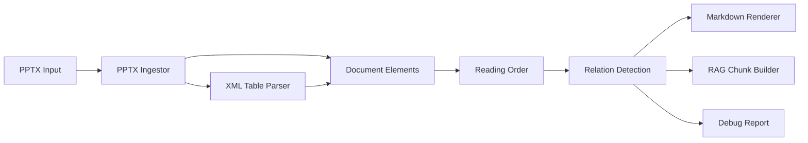

# doc-xml-parser

PPTX(XML) 기반 문서를 LLM/RAG 친화 포맷으로 변환하는 DDD 아키텍처 파서입니다.

- 입력: `*.pptx`
- 출력: 구조화 JSON, Markdown, RAG chunk JSON, 디버그 리포트 JSON
- 핵심 기능: Reading Order (XY-Cut/Composite), 공간 그룹/칼럼 감지, 테이블 병합셀 복원, 이미지 추출, 관계 추론, 텍스트 서식 보존, PPTX 수식(OMML) 1차 추출

## 문서 안내 (Docs)

프로젝트 상세 문서는 `docs/`에 정리되어 있습니다.

- `docs/README.md`: 문서 인덱스
- `docs/architecture_diagrams.md`: 시스템/레이어/데이터 흐름 다이어그램
- `docs/operations.md`: 실행/운영 절차
- `docs/evaluation.md`: 평가 기준과 베이스라인 해석
- `docs/pseudocode/README.md`: 핵심 알고리즘 수도코드 문서 인덱스

중요 구현 변경(회귀 가능성이 큰 항목)은 아래 문서에서 먼저 확인하는 것을 권장합니다.

- `docs/pseudocode/01_ingestion/01_overview.md`
- `docs/operations.md`
- `docs/evaluation.md`

## 현재 구현 범위 (Implemented)

이 섹션은 **현재 코드에 실제로 구현된 기능만** 설명합니다.

- 입력 포맷: `*.pptx`
- 요소 추출: 텍스트/이미지/테이블/차트/그룹/기타 shape
- 테이블: XML 기반 병합셀 복원(`gridSpan`, `rowSpan`, `hMerge`, `vMerge`) — `true`/`continue`/`1` 통합 인식
- 테이블 렌더링: 기본 HTML `<table>` 출력 + 병합셀 span(`colspan`, `rowspan`) 보존 + `<colgroup>`으로 원본 컬럼 너비 비율 보존
- 테이블-도형 결합: Containment Ratio 기반으로 테이블 위 텍스트박스/이미지를 셀 콘텐츠로 흡수 (흡수 요소는 셀 중앙선 기준 위/아래 배치)
- 테이블 헤더 감지: `rowspan`이 `<thead>`/`<tbody>` 경계를 넘지 않도록 자동 확장
- 테이블-in-테이블: 큰 테이블 셀 안에 포함된 작은 테이블을 nested HTML `<table>`로 렌더링
- HTML 테이블 내 이미지: `` 태그로 렌더링 (HTML 블록 내 Markdown 이미지 문법 호환 문제 해결)
- 엘레멘트 중첩 해소: Containment Graph로 포함 관계 감지 (텍스트 병합, 도형-바운딩박스 그룹화)
- 슬라이드 마스터/레이아웃 shape 추출 (템플릿 텍스트 자동 필터링, content hash 기반 중복 제거)
- 글머리 기호/번호 보존: `<a:buAutoNum>`, `<a:buChar>` paragraph 속성에서 bullet prefix 추출 (arabicPeriod, circleNumDbPlain, 문자 bullet 등)
- **텍스트 서식 보존**: `<a:rPr>` 런 속성에서 bold/italic/underline 추출 → Markdown(`**`, `*`, `<u>`) 및 HTML 테이블(`<b>`, `<i>`, `<u>`)로 렌더링 (`preserve_text_formatting`)
- **노이즈 요소 필터링**: 빈 텍스트/UNKNOWN 타입/극소 면적 요소 자동 제거 (`filter_noise_elements`, `min_element_area`)
- **이미지 주석 흡수**: 이미지 내부의 짧은 텍스트 레이블을 annotation으로 묶어 이탤릭으로 렌더링 (`absorb_image_annotations`)
- **`title_of` 공간 범위 제한**: 타이틀 아래 + 최대 Y 거리 이내 요소에만 연결 (`title_max_y_distance`)
- **공간 그룹 메타데이터**: XY-Cut 재귀 분할 시 `spatial_group` 경로를 요소 metadata에 부여 (예: `0.h0.v1`)
- **칼럼 구분자**: Markdown에서 수직 분할 경계를 `<!-- column-break -->`로 표시하여 다단 구조 보존
- 이미지: 그룹 내부 이미지 재귀 추출 + PPTX crop 반영 저장
- 수식: OMML 토큰 1차 추출 (`[MATH] ...` 형태)
- Reading Order 전략:
  - `ReadingOrderStrategy` domain port (확장 가능)
  - `RowClusteringStrategy`: Y-tolerance 기반 행 클러스터링
  - `XYCutStrategy`: 재귀 XY-Cut (다단 레이아웃 대응)
  - `CompositeStrategy` (기본): placeholder 인덱스 우선 + XY-Cut fallback
  - CLI: `--reading-order composite|row_clustering|xy_cut`
- 관계 추론:
  - `RelationScorer` / `RelationReranker` domain ports (VLM 확장 가능)
  - `RuleBasedScorer`: proximity, alignment, size_ratio, position, text_hint 가중합
  - `NoopRelationReranker`: 기본 pass-through (향후 VLM reranker 대체 가능)
  - 관계 타입: `title_of`, `caption_of`, `related_to` (+ `illustrates` 확장 예정)
  - 충돌 해소: confidence 내림차순 greedy assignment
- 정량 평가:
  - Golden label 기반 평가 (`testdata/golden/`)
  - `scripts/evaluate_golden.py`: Kendall Tau, NED, P/R/F1
  - `tests/test_golden_regression.py`: 회귀 방지 자동 테스트
- 출력:
  - 구조화 JSON (`--output-json`)
  - Markdown (`--output-md`)
  - RAG chunk JSON (`--output-rag-json`)
  - 디버그 리포트 JSON (`--output-debug-json`)
- 캡션 검증기:
  - `CaptionVerifier` 확장 포트 존재
  - 기본 구현은 `NoopCaptionVerifier` (실제 VLM 호출 없음)

## 설계 원칙 (Layout-First Relation Inference)

문서 지능(Document Intelligence) 관점에서 본 프로젝트의 기본 철학은 다음과 같습니다.

- 목표는 일반 이미지 캡셔닝이 아니라 **문서 내 관계 추론**입니다.
- 관계 추론의 1차 신호는 의미(vision-language)보다 **레이아웃/구조**입니다.
  - 상대 위치(위/아래/좌/우)
  - 정렬/간격
  - reading order
  - 그룹/표/문단 구조
- 시맨틱 모델(CLIP/VLM)은 기본 엔진이 아니라 **애매한 케이스 보조 신호**로 다룹니다.

즉, 현재/향후 방향은 다음 식에 가깝습니다.

- `Relation ~= layout + structure + text_style (+ optional semantic rerank)`

## 향후 확장 범위 (Not Implemented Yet)

이 섹션은 **아직 구현되지 않은 계획/확장 아이디어**입니다.

- 실제 VLM/CLIP 기반 `CaptionVerifier` / `RelationReranker` 어댑터
- VLM 기반 Reading Order 전략 (`ModelBasedOrderStrategy`)
- 수식 이미지 OCR fallback
- `illustrates`, `evidence_for` 관계 타입 본격 활용

위 항목들은 현재 결과에 기본 적용되지 않으며, 별도 구현/설정이 필요합니다.

## 확장 계획 및 아이디어 (Roadmap)

아래 항목은 구현 우선순위를 제안하는 로드맵입니다.  
각 단계는 독립적으로 적용 가능하며, 단계별 품질 측정 후 다음 단계로 진행하는 것을 권장합니다.

### 1) Relation Inference 고도화

- **목표**: `caption_of`, `title_of`의 정밀도/재현율 개선
- **아이디어**
  - 페이지 내부 후보 생성(top-k)과 최종 선택(decision)을 분리
  - 단일 규칙 임계치 대신 가중합 점수(`layout + text_style + structure`) 사용
  - 충돌 해소 규칙 추가:
    - 한 텍스트가 여러 이미지에 동시에 연결될 때 최고점 1개만 유지
    - 표와 이미지 사이 경쟁 관계에서 타입 일관성 우선
- **산출물**
  - `debug.json`에 후보군/탈락 사유/점수 분해(logit) 기록
  - 평가용 샘플셋(수동 라벨) 기반 Precision/Recall 리포트

### 2) Reading Order 문서 유형별 최적화

- **목표**: 다단/복합 레이아웃에서 순서 오류 감소
- **아이디어**
  - 현재 row clustering 외에 문서 유형 프로파일 도입:
    - 제목 슬라이드
    - 목차 슬라이드
    - 본문(텍스트+도표)
    - 표 중심 페이지
  - profile별 정렬 규칙/임계치 분리
  - 필요 시 XY-cut 변형을 보조 알고리즘으로 결합
- **산출물**
  - `reading_order_profile` 메타데이터
  - profile별 오차 사례집

### 3) 수식 처리 고도화

- **목표**: 수식 누락/파손 최소화
- **아이디어**
  - OMML 선형 추출 -> LaTeX 변환기 어댑터 추가
  - OMML이 없는 수식 이미지에 OCR fallback 적용(선택)
  - 수식 블록 렌더링 규칙 개선:
    - inline: `$...$`
    - block: `$$...$$`
- **산출물**
  - 수식 품질 지표(정확 매칭/부분 매칭)
  - 수식 포함 슬라이드에 대한 비교 리포트

### 4) Layout-First + Semantic Re-ranking (선택)

- **목표**: 애매한 관계 케이스만 보강
- **아이디어**
  - 기본은 layout-first 유지
  - 낮은 confidence 구간만 semantic re-ranker 적용
    - 경량 ITM/CLIP 점수
    - 필요 시 VLM verifier
  - 비용 제어:
    - 호출 상한
    - 캐시
    - timeout fallback
- **산출물**
  - 호출률/비용/정확도 개선율 리포트
  - 모델 미사용 대비 A/B 비교 결과

### 5) RAG 전처리 최적화

- **목표**: 검색/응답 품질 개선
- **아이디어**
  - chunk 전략 분리:
    - 본문형
    - 표형
    - 캡션 결합형
  - chunk 메타 확장:
    - page, section, element_ids, relation_summary
  - retriever 친화 포맷(`content`, `metadata`, `anchors`) 고정
- **산출물**
  - rag chunk schema v2
  - retrieval benchmark(Top-k hit rate) 결과

### 6) 평가/운영 체계

- **목표**: 회귀 방지와 운영 안정성 확보
- **아이디어**
  - golden set + 회귀 테스트 파이프라인 구축
  - 문서군별 실패 패턴 taxonomy 관리
  - 성능 메트릭 수집:
    - 처리시간(페이지당)
    - 메모리 사용량
    - 실패율/재시도율
- **산출물**
  - 품질 대시보드용 JSON 리포트
  - 릴리즈 체크리스트

## 연구 관점 메모

- 본 문제는 일반 이미지 캡셔닝이 아니라 **문서 내 관계 추론** 문제에 가깝습니다.
- 따라서 모델 중심 접근보다 **레이아웃/구조 priors**를 우선하고,
  시맨틱 모델은 재랭킹/검증 단계로 제한하는 접근이 효율적입니다.
- 향후 논문화/기술문서화 시 다음 문제 정의를 기준으로 정리 가능합니다:
  - `P(relation | layout, structure, text_style, semantics)`

## 이미지-텍스트 관계 방향성 가이드

문서에서는 이미지와 텍스트 관계가 항상 `텍스트 -> 이미지`(캡션) 형태가 아닙니다.  
이미지가 본문 텍스트를 설명/보강하는 역방향 관계도 자주 발생합니다.

권장 관계 타입:

- `caption_of`: 텍스트가 이미지를 직접 설명하는 캡션
- `illustrates`: 이미지가 텍스트/개념을 예시로 설명
- `evidence_for`: 이미지(그래프/결과)가 텍스트 주장 근거를 제공
- `decorative`: 문맥 정보가 거의 없는 장식성 이미지
- `related_to`: 방향성이 불분명한 약한 연관 관계

판별 원칙(권장):

- **강한 확신이 있을 때만 방향성 관계(`caption_of`, `illustrates`)를 부여**
- 애매한 경우는 `related_to`로 보수적으로 남겨 오탐을 줄임
- 문서 QA/RAG 목적에서는 잘못된 강한 관계보다 약한 관계가 더 안전함

현재 구현 상태:

- 현재 코드는 `title_of`, `caption_of` 중심으로 동작합니다.
- 위의 추가 관계 타입은 향후 확장 항목이며, relation schema 확장과 렌더링 정책 업데이트가 필요합니다.

## 핵심 파이프라인



## DDD 구조

```mermaid
flowchart TB
    subgraph interfacesLayer [Interfaces]
        CLI[CLI]
    end
    subgraph applicationLayer [Application]
        UseCase[ParseDocumentUseCase]
        Order[ReadingOrder]
        Relation[Relationships]
        Eval[Evaluation Metrics]
        Render[MarkdownRenderer]
        Rag[RagPack]
        Debug[DebugReport]
    end
    subgraph domainLayer [Domain Ports]
        Entity[Entities]
        IngestPort[DocumentIngestor]
        ROPort[ReadingOrderStrategy]
        ScorerPort[RelationScorer]
        RerankerPort[RelationReranker]
        VerifierPort[CaptionVerifier]
        ValueObj[ValueObjects]
    end
    subgraph infraLayer [Infrastructure]
        PptxIng[PptxIngestor]
        TableXml[PptxTableXml]
        RowCluster[RowClusteringStrategy]
        XYCut[XYCutStrategy]
        Composite[CompositeStrategy]
        RuleScorer[RuleBasedScorer]
        NoopReranker[NoopRelationReranker]
    end

    CLI --> UseCase
    UseCase --> Order
    UseCase --> Relation
    UseCase --> Render
    UseCase --> Rag
    UseCase --> Debug
    UseCase --> IngestPort
    UseCase --> ROPort
    PptxIng -.-> IngestPort
    PptxIng --> TableXml
    RowCluster -.-> ROPort
    XYCut -.-> ROPort
    Composite -.-> ROPort
    RuleScorer -.-> ScorerPort
    NoopReranker -.-> RerankerPort
```



## 빠른 시작 (uv)

```bash
uv sync
uv run doc-parser ./sample.pptx --output-json ./out/result.json
```

전체 출력 생성 예시:

```bash
uv run doc-parser ./sample.pptx \
  --output-json ./out/result.json \
  --output-md ./out/result.md \
  --output-rag-json ./out/rag_chunks.json \
  --output-debug-json ./out/debug.json \
  --assets-dir ./out/assets
```

## 설정 파일 (`--config-json`)

```json
{
  "row_tolerance": 0.02,
  "caption_max_gap": 0.06,
  "alignment_tolerance": 0.08,
  "title_max_len": 80,
  "chunk_max_chars": 1200,
  "table_cell_containment_threshold": 0.5,
  "containment_threshold": 0.6,
  "table_render_html": true,
  "include_master_shapes": true,
  "deduplicate_master_shapes": true,
  "reading_order_strategy": "composite",
  "xy_cut_gap_ratio": 0.006,
  "rel_proximity_weight": 0.35,
  "rel_alignment_weight": 0.25,
  "rel_size_ratio_weight": 0.15,
  "rel_position_weight": 0.15,
  "rel_text_hint_weight": 0.10,
  "filter_noise_elements": true,
  "min_element_area": 0.0001,
  "absorb_image_annotations": true,
  "image_annotation_containment_threshold": 0.5,
  "image_annotation_max_text_len": 60,
  "title_max_y_distance": 0.5,
  "preserve_text_formatting": true
}
```

사용 예시:

```bash
uv run doc-parser ./sample.pptx --config-json ./config.json --output-md ./out/result.md
```

## 수식(OMML) 지원 범위

- `m:oMath`, `m:oMathPara` 노드의 수식 토큰을 선형화해 추출합니다.
- Markdown/JSON 텍스트에 `[MATH] ...` 형태로 포함됩니다.
- 현재는 1차 추출 단계로, LaTeX 완전 변환은 아직 미지원입니다.

## 캡션 연결 전략

- **규칙 기반**: 거리, X축 겹침, 텍스트 길이, 키워드 기반 점수화로 `caption_of` 관계를 생성합니다.
- **검증기 확장 훅**: 점수가 애매한 구간은 `CaptionVerifier` 포트로 보냅니다.
  - 기본 구현은 `NoopCaptionVerifier`입니다.
  - VLM/멀티모달 모델을 `infrastructure/verifiers` 어댑터로 추가하면 확장할 수 있습니다.

## 테스트

```bash
uv sync --group dev
uv run pytest -q
```

## 공개 샘플

공유 가능한 데모 PPTX는 [`public_samples/`](public_samples/)에 있습니다.

```bash
uv run doc-parser public_samples/openxml_parser_public_sample.pptx \
  --output-md out/public_sample.md \
  --output-json out/public_sample.json \
  --assets-dir out/public_sample_assets
```

검증 포인트 (공개 샘플 기준):

- `<table>` 블록과 병합 셀 `colspan`/`rowspan`
- 셀 내 이미지 `` 렌더링
- nested `<table>`, 테이블-도형 흡수
- 마스터 템플릿 문구 필터링

로컬 전용 자료는 [`example/`](example/)·[`testdata/`](testdata/)에 두며 **저장소에 커밋하지 않습니다.**

실데이터 통합 테스트(옵션, 로컬 `testdata/pptx_samples/` 필요):

```bash
RUN_REAL_PPTX_TESTS=1 MAX_REAL_PPTX_TESTS=3 uv run pytest -q tests/test_real_pptx_dataset.py
RUN_REAL_PPTX_TESTS=1 uv run pytest -q tests/test_pptx_image_extract_integration.py
```

## 정량 평가 (Golden Label)

Golden label 기반 자동 평가:

```bash
uv run python scripts/evaluate_golden.py --output-json out/eval/golden_report.json
```

평가 지표:

- **Reading Order**: Kendall's Tau (순서 상관), Normalised Edit Distance
- **Relations**: Precision / Recall / F1 (relation type별)

Golden label JSON은 로컬 `testdata/golden/*.golden.json`에 두며 git에는 포함하지 않습니다.

회귀 테스트:

```bash
uv run pytest tests/test_golden_regression.py -v
```

## 평가 베이스라인 수집

관계 추론 품질 개선 전/후 비교를 위해 caption baseline 리포트도 생성할 수 있습니다.

```bash
uv run python scripts/evaluate_caption_baseline.py \
  --output-json out/eval/caption_baseline.json
```

리포트 해석 포인트:

- `caption_density_per_image`: 이미지 1개당 평균 캡션 연결 수
- `rejection_rate`: 후보 대비 탈락 비율

## 프로젝트 구조

```text
src/document_inteligence/
  domain/
    entities.py, repositories.py, value_objects.py
  application/
    use_cases.py, config.py, reading_order.py,
    relationships.py, evaluation.py, markdown_renderer.py,
    rag_pack.py, debug_report.py, containment_graph.py,
    table_absorber.py, image_annotation_absorber.py
  infrastructure/
    ingestors/      pptx_ingestor.py, pptx_table_xml.py
    strategies/     row_clustering_strategy.py, xy_cut_strategy.py, composite_strategy.py
    scorers/        rule_based_scorer.py
    rerankers/      noop_reranker.py
    verifiers/      noop_caption_verifier.py
  interfaces/
    cli.py
scripts/
  evaluate_golden.py, evaluate_caption_baseline.py
public_samples/
  openxml_parser_public_sample.pptx
testdata/          # local only (gitignored)
  golden/          # *.golden.json
example/           # local only (gitignored)
tests/
```

