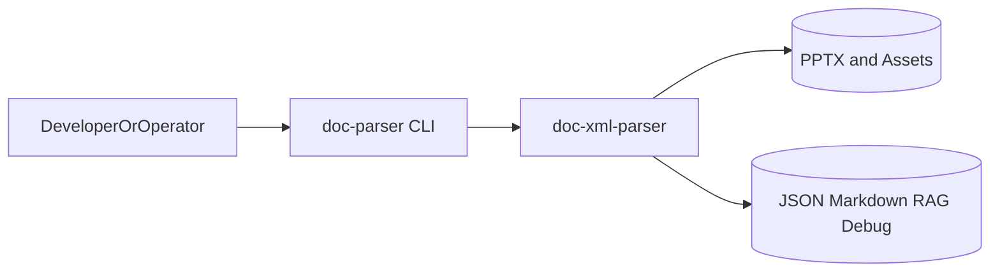
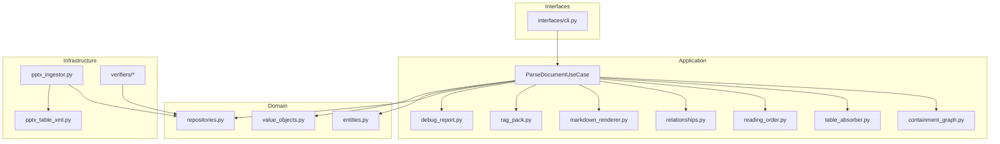
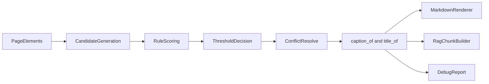

# Architecture Diagrams

## 1) System Context

```mermaid
flowchart LR
    User[DeveloperOrOperator]
    CLI[doc-parser CLI]
    Parser[doc-xml-parser]
    Files[(PPTX and Assets)]
    Outputs[(JSON Markdown RAG Debug)]

    User --> CLI
    CLI --> Parser
    Parser --> Files
    Parser --> Outputs
```

## 2) DDD Layer View

```mermaid
flowchart TB
    subgraph interfacesLayer [Interfaces]
        CLI[interfaces/cli.py]
    end
    subgraph applicationLayer [Application]
        UseCase[ParseDocumentUseCase]
        ContGraph[containment_graph.py]
        Absorber[table_absorber.py]
        Order[reading_order.py]
        Relation[relationships.py]
        Render[markdown_renderer.py]
        Rag[rag_pack.py]
        Debug[debug_report.py]
    end
    subgraph domainLayer [Domain]
        Entities[entities.py]
        Ports[repositories.py]
        Values[value_objects.py]
    end
    subgraph infraLayer [Infrastructure]
        Ingestor[pptx_ingestor.py]
        TableXml[pptx_table_xml.py]
        Verifier[verifiers/*]
    end

    CLI --> UseCase
    UseCase --> ContGraph
    UseCase --> Absorber
    UseCase --> Order
    UseCase --> Relation
    UseCase --> Render
    UseCase --> Rag
    UseCase --> Debug
    UseCase --> Ports
    Ingestor --> Ports
    Ingestor --> TableXml
    Verifier --> Ports
    UseCase --> Entities
    UseCase --> Values
```

## 3) Relation Inference Data Flow

```mermaid
flowchart LR
    Elements[PageElements] --> CandidateGen[CandidateGeneration]
    CandidateGen --> RuleScoring[RuleScoring]
    RuleScoring --> Decision[ThresholdDecision]
    Decision --> ConflictResolve[ConflictResolve]
    ConflictResolve --> Relations[caption_of and title_of]
    Relations --> Markdown[MarkdownRenderer]
    Relations --> Rag[RagChunkBuilder]
    Relations --> Debug[DebugReport]
```

## 4) Containment and Absorption Flow

```mermaid
flowchart LR
    Ingest["PptxIngestor (slide+master)"]
    CellBBox[TableCellBBoxBuild]
    ContGraph[ContainmentGraph]
    Absorb["TableAbsorber (elements + nested tables)"]
    FilterAbsorbed[FilterAbsorbedElements]
    Ordered[ReadingOrder]
    HtmlTable[HtmlTableRenderer]
    MarkdownOut[MarkdownOutput]

    Ingest --> CellBBox
    CellBBox --> ContGraph
    ContGraph --> Absorb
    Absorb --> FilterAbsorbed
    FilterAbsorbed --> Ordered
    Ordered --> HtmlTable
    HtmlTable --> MarkdownOut
```

